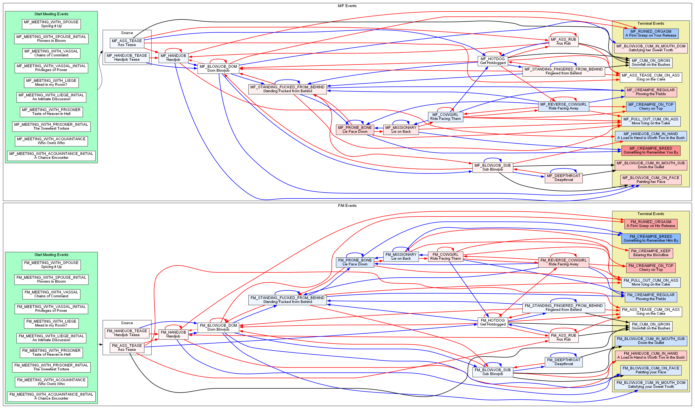

## Overview
You only need this repository if you're
planning to write events or otherwise contribute
to it. If you're just looking to use it, it's
better to use the one from release sites (discord or loverslab).

## Contribution Guide
1. install git (version management tool) and read about some of its basic usage
2. create account on [github.com](github.com)
3. fork this [repoistory](https://github.com/PerplexedPeach/dynamic_affairs) by clicking the fork button near the top right
4. clone (download) your forked repository by clicking the green button, getting a link, then on command line
    type something like `git clone https://github.com/PerplexedPeach/dynamic_affairs` but replace it with the link
    to your own fork.
5. put the repository under `C:\Users\<username>\Documents\Paradox Interactive\Crusader Kings III\mod\`
6. add it as a mod in the paradox launcher
7. make changes to the code in `generate_events.py` (detailed guide below)
8. (optional) install [graphviz](https://graphviz.org/download/) to produce a graphical representation of the events,
    which is really helpful for organizing and debugging things
9. run the generation script with `python generate_events.py` which will generate `vis.png` if you have graphviz
    installed and on your path
10. test your changes in game's debug mode - you don't have to restart the game for file changes to take effect!
11. commit your change (`git commit`) and push to your remote forked repository
12. submit pull request on the github page for your fork
13. I'll review the fork then merge or give feedback

## Event Writing Guide
All code is inside `generate_events.py`.
You'll care mostly about the `EventSex`, `EventCum` enums at the top of the file which has the IDs for all types
of events. It's pretty straightforward, and you should just follow the existing event conventions.

For event writing, you should write everything in **second person present tense**.
You'll care most about the `define_events` function at the bottom of the file, where you can define events
in the format of the following commented example:
```python
    # Sex is the event class; use Cum for the cum events
    # Handjob Tease is the english localized title
    es.add(Sex(EventsSex.HANDJOB_TEASE, "Handjob Tease",
               # stamina cost of this event for the player (cost_1) and the partner (cost_2)
               stam_cost_1=0, stam_cost_2=1,
               # this event is only for when the player (root) character is female; this is by default 
               root_female=True,
               # description that shows up in the text body
               # {THEM} will result in their first name that's mouse-overable to get a tooltip
               desc=f"""With a knowing smirk, you size {THEM} up and put both your hands on their chest.
                    Leveraging your weight, you push and trap him against a wall. You slide your knee up his leg 
                    and play with his bulge. 
                    \\n\\n
                    "Is that a dagger in your pocket, or are you glad to see me?"
                    \\n\\n
                    Tracing your fingers against thin fabric, you work your way up above his trouser before 
                    pulling down to free his member. It twitches at the brisk air and the sharp contrast in 
                    sensation against your warm hands.""",
               # only fill the following out if this event has special text when you cum
               root_cum_text=f"""
               When the root character cums, this is the text that shows up in place of the stamina description.
               Leave this unfilled (by default None) to use a default description.
               """,
               # this defines what followup events exist for it, the type of transition, the text that should show up
               options=(
                   # unless the partner is cumming, one DOM and one SUB transition will be chosen 
                   # this is a DOM type transition (so it will be challenged by the partner)
                   # if you choose a DOM type transition and fail, you'll default to a sub transition
                   # DOM transitions require failed_transition_text which will show up when you fail to dominate them
                   Option(EventsSex.HANDJOB, OptionCategory.DOM,
                          # text that will show up on the option button
                          "Jerk him off",
                          # text that will show up at the beginning of the next event
                          transition_text="Your continue building a rhythm going up and down his shaft with your hands.",
                          # text that will show up at the beginning of the next event if you fail to dom
                          failed_transition_text="You're too turned on to be satisfied with just jerking him off."),
                   Option(EventsSex.BLOWJOB_DOM, OptionCategory.SUB,
                          "Kneel down and take him in your mouth",
                          transition_text=f"""
                          Looking up, you spot a look of anticipation on {THEM}'s face. 
                          They were probably not expecting you to volunteer your mouth's service.
                          They start moving a hand to place behind your head, but you swat it away."""),
                   # if this event can directly lead to cum, you should define cum transition type options
                   Option(EventsCum.HANDJOB_CUM_IN_HAND, OptionCategory.CUM,
                          "Milk him into your soft palms", ),
               )))
```

Check out [https://ck3.paradoxwikis.com/Localization](https://ck3.paradoxwikis.com/Localization) for 
fancy formatting of text.
Current event graph: 